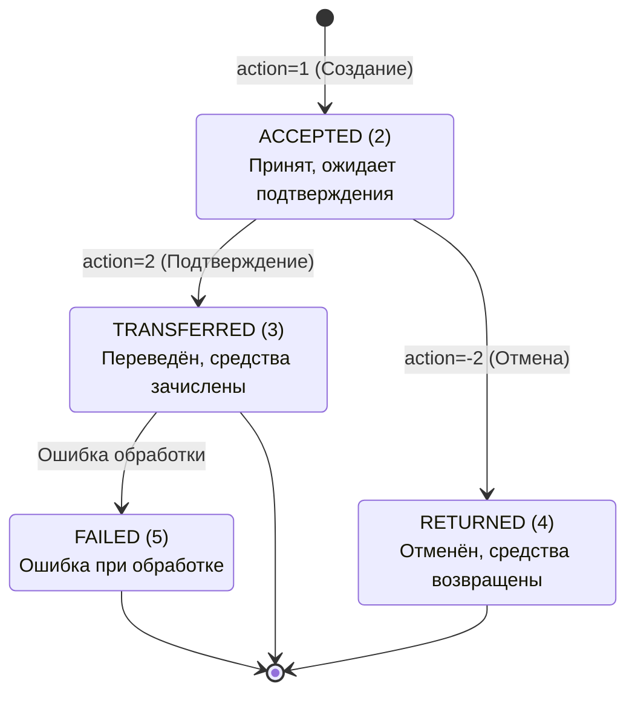
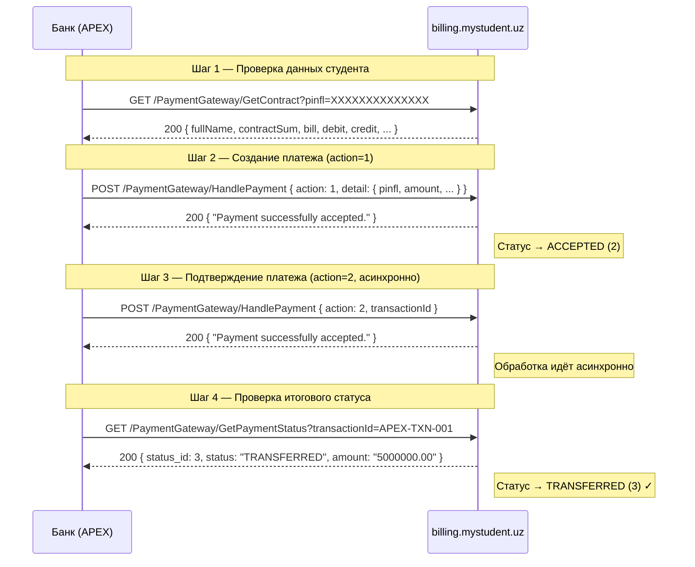
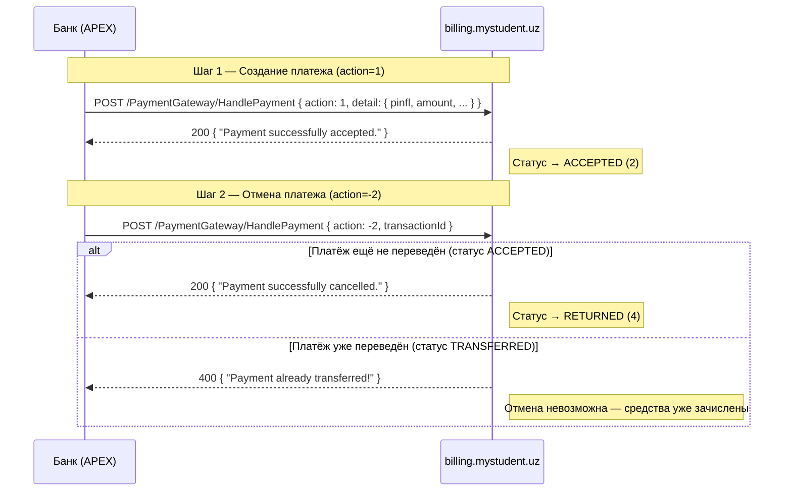
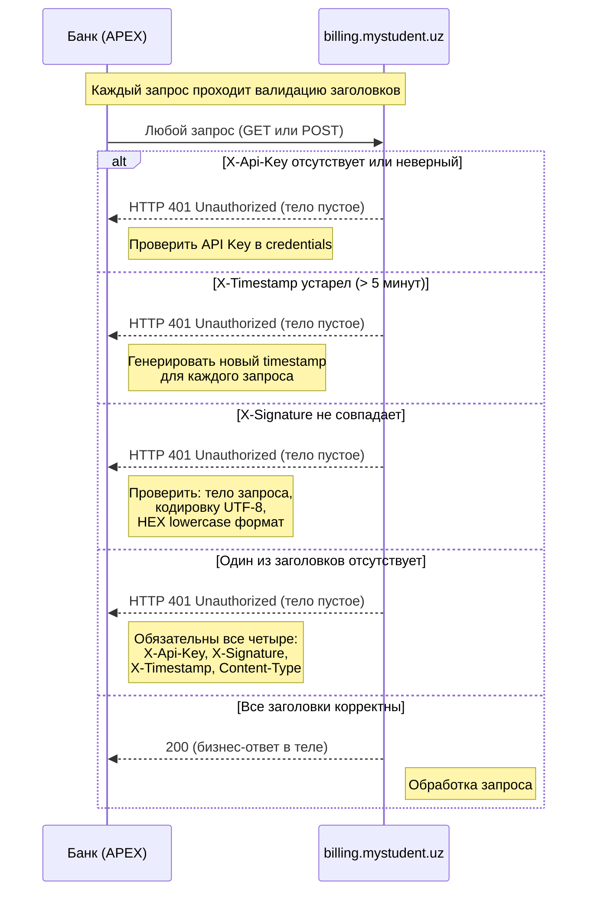

# Анализ API — Contract Payments (TIU)

> **Источники:** `APEX_Credentials.txt` + `ContractPayments_API_Integratsiya_Hujjati.pdf` v2.0  
> **Дата документа:** 04.05.2026 | **Статус:** Конфиденциально  
> **Дата анализа:** 05.05.2026

---

## 1. Общее описание

API предназначен для обработки платежей студентов по образовательным контрактам (TIU — billing.mystudent.uz). Банк выступает как **платёжный агент** между студентом и университетом.

**Поддерживаемые платёжные системы:**

| ID | Система | Статус |
|----|---------|--------|
| 6  | BRB     | Активна |
| 7  | **APEX**    | Активна |

Интеграция с банком ведётся через **APEX** (ID=7).

---

## 2. Реквизиты доступа (APEX)

| Параметр   | Значение |
|------------|----------|
| Base URL   | `https://billing.mystudent.uz` |
| API Key    | `01ee4f9fe0cd4559c50bc54d93f9b87817df97e625f7d305` |
| Secret Key | `1018b851bad301536a6f809da80f28f4321af32e9f374d881ea13a0bdf0650d6` |

> **ВАЖНО:** Secret Key нельзя хранить в открытом виде в репозиториях, конфигах или передавать третьим лицам. Файл `APEX_Credentials.txt` следует перенести в защищённое хранилище (vault/secrets manager).

---

## 3. Аутентификация

Каждый запрос должен содержать **три обязательных заголовка**:

| Заголовок     | Значение                              | Назначение |
|---------------|---------------------------------------|------------|
| `X-Api-Key`   | API Key из credentials                | Идентификация клиента |
| `X-Signature` | `HMAC-SHA256(request_body, secret_key)` в HEX lowercase | Проверка целостности |
| `X-Timestamp` | Unix timestamp (секунды)              | Защита от replay-атак |
| `Content-Type`| `application/json`                    | Формат тела |

**Правила формирования подписи:**
- Для `POST` — подписывается JSON-тело запроса
- Для `GET` — подписывается строка query string (например, `?pinfl=12345678901234`)
- Запросы старше **5 минут** отклоняются (HTTP 401)
- Каждый запрос требует **нового** timestamp

**Примеры кода подписи:**

```python
# Python
import hmac, hashlib, time, json

signature = hmac.new(
    secret_key.encode("utf-8"),
    body.encode("utf-8"),
    hashlib.sha256
).hexdigest()
```

```java
// Java
Mac mac = Mac.getInstance("HmacSHA256");
SecretKeySpec keySpec = new SecretKeySpec(secretKey.getBytes("UTF-8"), "HmacSHA256");
mac.init(keySpec);
String signature = bytesToHex(mac.doFinal(body.getBytes("UTF-8"))).toLowerCase();
```

```csharp
// C#
using var hmac = new HMACSHA256(Encoding.UTF8.GetBytes(secretKey));
string signature = Convert.ToHexString(hmac.ComputeHash(Encoding.UTF8.GetBytes(body))).ToLower();
```

---

## 4. Эндпоинты API

Все эндпоинты находятся под префиксом `/PaymentGateway/`:

| Метод  | Маршрут                            | Описание |
|--------|------------------------------------|----------|
| `GET`  | `/PaymentGateway/GetContract`      | Получение данных контракта студента |
| `POST` | `/PaymentGateway/HandlePayment`    | Создание / подтверждение / отмена платежа |
| `GET`  | `/PaymentGateway/GetPaymentStatus` | Проверка статуса платежа |

---

### 4.1 GET /PaymentGateway/GetContract

Возвращает информацию о контракте студента по ПИНФЛ.

**Query-параметры:**

| Параметр        | Тип    | Обязателен | Описание |
|-----------------|--------|------------|----------|
| `pinfl`         | string | Да         | ПИНФЛ студента (14 цифр) |
| `contractTypeId`| int    | Нет        | Тип контракта (по умолчанию: 1) |

**Примеры запросов:**
```
GET /PaymentGateway/GetContract?pinfl=12345678901234
GET /PaymentGateway/GetContract?pinfl=12345678901234&contractTypeId=2
```

**Успешный ответ (200):**
```json
{
  "status": 200,
  "message": "Success",
  "data": {
    "fullName": "Aliyev Jasur Karimovich",
    "university": "TATU",
    "debit": 10000000.00,
    "credit": 5000000.00,
    "contractNumber": "C-2024-001",
    "contractSum": 15000000.00,
    "course": "3",
    "bill": "40702840900000001234",
    "speciality": "Kompyuter fanlari",
    "eduType": "Bakalavr",
    "mfo": "00084",
    "eduForm": "Kunduzgi",
    "bank": "NBU",
    "universityCode": "UNI001"
  }
}
```

**Поля ответа `data`:**

| Поле              | Тип       | Описание |
|-------------------|-----------|----------|
| `fullName`        | string    | ФИО студента |
| `university`      | string    | Название университета |
| `debit`           | decimal?  | Общая задолженность |
| `credit`          | decimal?  | Всего оплачено |
| `contractNumber`  | string    | Номер контракта |
| `contractSum`     | decimal?  | Сумма контракта |
| `course`          | string    | Курс |
| `bill`            | string    | Номер счёта |
| `speciality`      | string    | Специальность |
| `eduType`         | string    | Тип образования (Бакалавр, Магистр и др.) |
| `mfo`             | string    | МФО банка |
| `eduForm`         | string    | Форма обучения (Очная, Заочная и др.) |
| `contractType`    | string    | Тип контракта |
| `lastPayment`     | decimal?  | Сумма последнего платежа |
| `lastPaymentDate` | date?     | Дата последнего платежа |
| `bank`            | string    | Название банка |
| `universityCode`  | string    | Код университета |

**Ошибка (студент не найден):**
```json
{ "status": 400, "message": "Not found" }
```

---

### 4.2 POST /PaymentGateway/HandlePayment

Единый эндпоинт для всех операций с платежом. Тип операции задаётся полем `action`.

| `action` | Операция           | Описание |
|----------|--------------------|----------|
| `1`      | Создание платежа   | Регистрация нового платежа |
| `2`      | Подтверждение      | Подтверждение ранее созданного платежа |
| `-2`     | Отмена             | Отмена платежа (только в статусе ACCEPTED) |

#### action=1 — Создание платежа

```json
{
  "transactionId": "APEX-TXN-20260504-00001",
  "action": 1,
  "detail": {
    "pinfl": "12345678901234",
    "amount": 5000000.00,
    "fullName": "Aliyev Jasur Karimovich",
    "contractNumber": "C-2024-001",
    "universityCode": "UNI001",
    "organizationAccount": "40702840900000001234",
    "paymentDate": "2026-05-04T14:30:00",
    "contractTypeId": 1
  }
}
```

| Поле                       | Тип      | Обязателен | Описание |
|----------------------------|----------|------------|----------|
| `transactionId`            | string   | Да         | Уникальный ID транзакции на стороне банка |
| `action`                   | int      | Да         | `1` |
| `detail.pinfl`             | string   | Да         | ПИНФЛ (14 цифр) |
| `detail.amount`            | decimal  | Да         | Сумма платежа (сум) |
| `detail.fullName`          | string   | Да         | ФИО плательщика |
| `detail.contractNumber`    | string   | Да         | Номер контракта |
| `detail.universityCode`    | string   | Да         | Код университета |
| `detail.organizationAccount` | string | Да         | Счёт организации |
| `detail.paymentDate`       | DateTime | Да         | Дата и время платежа (ISO 8601) |
| `detail.contractTypeId`    | int      | Нет        | Тип контракта (по умолчанию: 1) |

**Ответ:** `{ "status": 200, "message": "Payment successfully accepted." }`

#### action=2 — Подтверждение платежа

```json
{ "transactionId": "APEX-TXN-20260504-00001", "action": 2, "detail": null }
```

> Подтверждение выполняется **асинхронно**. Итоговый статус необходимо проверять через `GetPaymentStatus`.

#### action=-2 — Отмена платежа

```json
{ "transactionId": "APEX-TXN-20260504-00001", "action": -2, "detail": null }
```

> Отменить можно только платёж в статусе **ACCEPTED**. Для уже переведённых платежей возвращается `status=400`.

---

### 4.3 GET /PaymentGateway/GetPaymentStatus

```
GET /PaymentGateway/GetPaymentStatus?transactionId=APEX-TXN-001
```

**Ответ:**
```json
{
  "status": 200,
  "message": "Success",
  "data": {
    "status": "Qabul qilingan",
    "status_id": 2,
    "id": "APEX-TXN-001",
    "amount": "5000000.00"
  }
}
```

---

## 5. Статусы платежа

| `status_id` | Название                | Описание                        |
| ----------- | ----------------------- | ------------------------------- |
| `1`         | Создан                  | Внутренний статус системы       |
| `2`         | Принят (ACCEPTED)       | Ожидает подтверждения           |
| `3`         | Переведён (TRANSFERRED) | Подтверждён, средства зачислены |
| `4`         | Возвращён (RETURNED)    | Отменён, средства возвращены    |
| `5`         | Ошибка (FAILED)         | Ошибка при обработке            |

**Диаграмма переходов статусов:**



---

## 6. Типы контрактов (`contractTypeId`)

| ID | Код        | Описание |
|----|------------|----------|
| 1  | CONTRACT   | По договору об обучении (по умолчанию) |
| 2  | CREDIT     | По образовательному кредиту |

> `contractTypeId` используется в `GetContract` и `HandlePayment (action=1)`. При подтверждении и отмене — не требуется.

---

## 7. Коды ошибок

### Ошибки в теле ответа (HTTP всегда 200)

| `status` | Ситуация                  | Сообщение |
|----------|---------------------------|-----------|
| 200      | Успех                     | `Payment successfully accepted.` |
| 400      | Некорректные данные       | `Data is not valid!` |
| 400      | Не найдено                | `Not found` |
| 400      | Уже переведён             | `Payment already transferred!` |
| 404      | Платёж не найден          | `Payment not found!` |
| 500      | Ошибка сервера            | `Error while processing payment.` |

### HTTP-ошибки аутентификации (тело пустое)

| HTTP | Причина |
|------|---------|
| 401  | Отсутствует или неверный `X-Api-Key` |
| 401  | Подпись `X-Signature` не совпадает |
| 401  | `X-Timestamp` устарел (> 5 минут) |
| 401  | Отсутствует один из обязательных заголовков |

---

## 8. Сценарий интеграции (happy path)



---

### 8.2 Сценарий отмены платежа



### 8.3 Обработка ошибок аутентификации



> **Важно:** HTTP 401 возвращается с **пустым телом** — в отличие от бизнес-ошибок (400/404/500), которые содержат JSON с полем `message`. Обработчик ошибок на стороне банка должен различать эти два случая.

---

## 9. Критические требования к реализации

| # | Требование | Приоритет |
|---|------------|-----------|
| 1 | `transactionId` должен быть **уникальным** для каждого платежа | Критично |
| 2 | Перед созданием платежа **всегда** вызывать `GetContract` для проверки данных | Высокий |
| 3 | После `action=2` проверять итоговый статус через `GetPaymentStatus` (асинхронность) | Высокий |
| 4 | Генерировать **новый** timestamp для каждого запроса | Критично |
| 5 | `Secret Key` хранить только в защищённом хранилище (не в коде, не в git) | Критично |
| 6 | Отмена (`action=-2`) возможна только в статусе ACCEPTED (status_id=2) | Важно |
| 7 | Реализовать retry-логику с проверкой через `GetPaymentStatus` (избегать дублирования) | Высокий |

---

## 10. Открытые вопросы и риски

| # | Вопрос / Риск | Статус |
|---|---------------|--------|
| 1 | Нет webhook/callback — банк обязан сам поллить `GetPaymentStatus`. Нужно уточнить интервал и количество попыток | Требует уточнения |
| 2 | Что происходит при дублировании `transactionId`? Документ не описывает поведение | Требует уточнения |
| 3 | Нет описания rate limits (лимитов запросов в секунду) | Требует уточнения |
| 4 | `Secret Key` передан в открытом `.txt` файле — необходим перевод в vault | Риск безопасности |
| 5 | Статус `FAILED` (5) — нет описания, как реагировать и есть ли авторетрай на стороне TIU | Требует уточнения |
| 6 | Нет описания тестовой/sandbox среды | Требует уточнения |
